<!-- PROJECT LOGO -->
<br />
<p align="center">
  <a href="https://github.com/FranciscoDadone/rcplanes.global.bot-webversion">
    
</a>

  <h3 align="center">rcplanes.global.bot</h3>
  <p align="center">
  Instagram bot to fetch images and videos of RC planes and repost them.
<br />
    <br />
  </p>
</p>

This started as a way to advertise and make more visible RC stuff.

It's a bot that fetches posts from different hashtags using the Instagram API and let you add media to a queue to later be autoposted (with a rate that is configurable). It also adds a watermark with the page mention and original post owner credit in the left bottom of all the images. It has a user-friendly web interface built with ```ReactJS``` that let you know all that is happening in the app.

This project is based on my other project that is the same app but built using Electron for Desktop.

### Built With

* [NodeJS](https://nodejs.org)
* [Express](https://expressjs.com)
* [Sqlite3](https://www.sqlite.org/index.html)
* [ReactBootstrap](https://react-bootstrap.github.io/)
* [ReactJS](https://reactjs.org/)
* [TypeScript](https://www.typescriptlang.org/)

# Images
- Login page: Dashboard login (default creds: admin:admin)
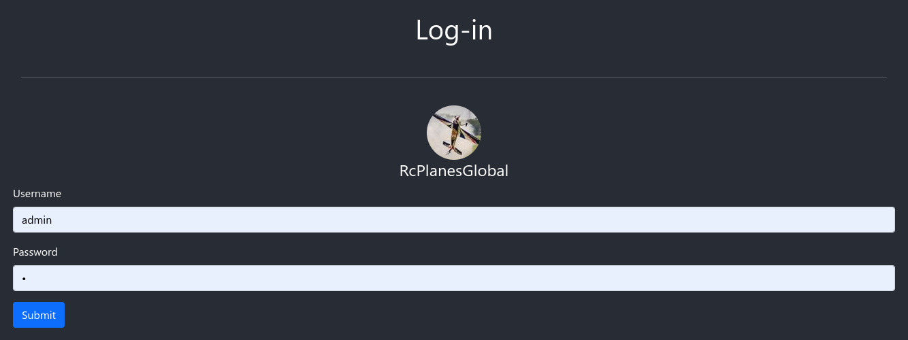

- Explore page: Main page where fetched content will show.
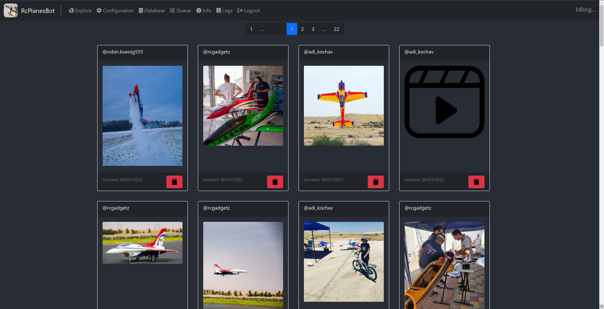

- Media popup: this shows when you click an image in the explore page and let you decide to delete that post or send it to the queue.
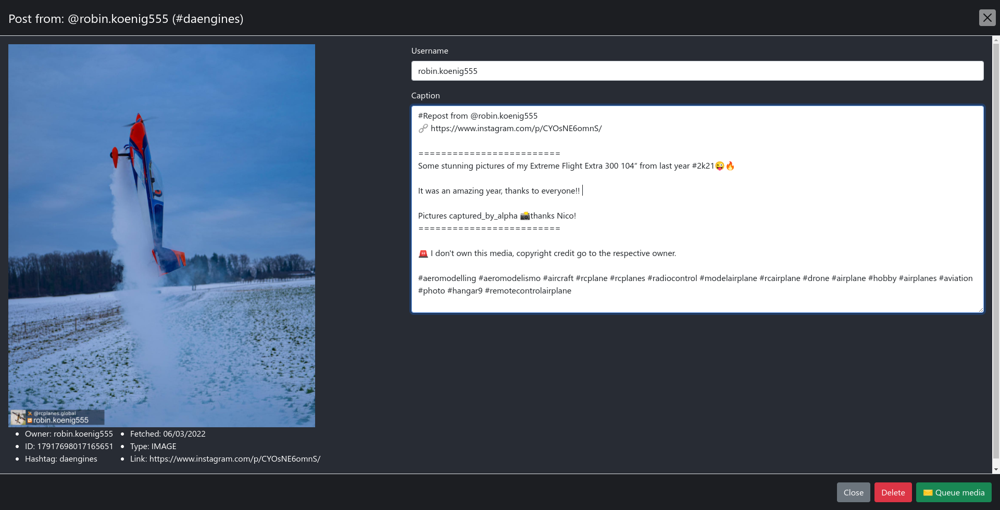

- Configuration page
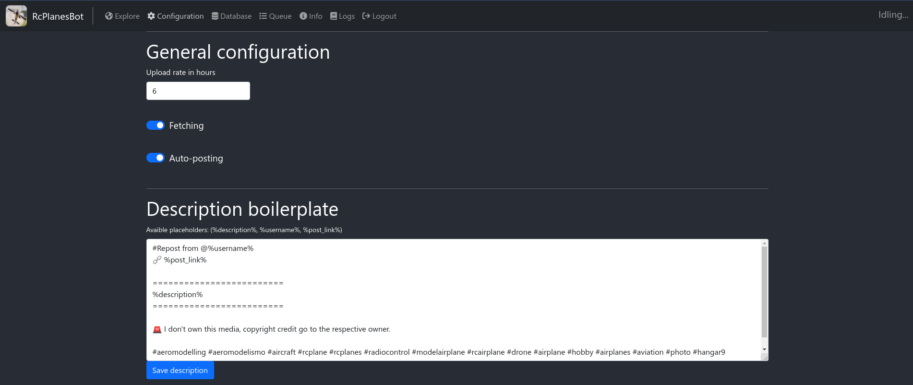
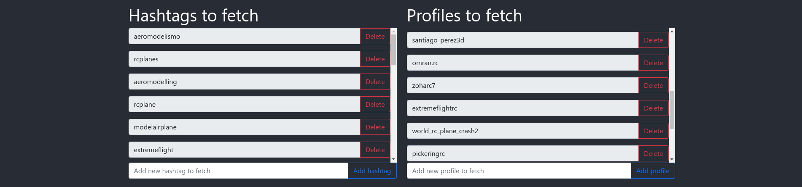
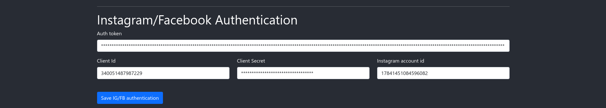
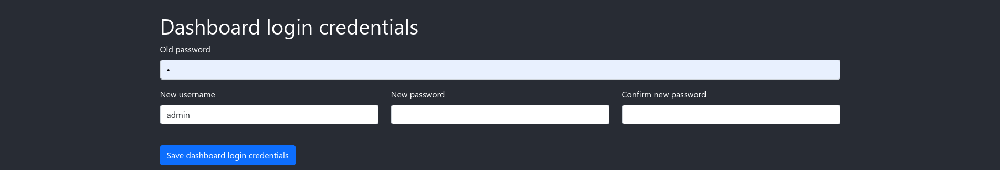

- Database page: page that shows database contents.
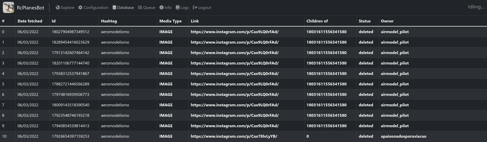

- Queue: media queue of selected content.
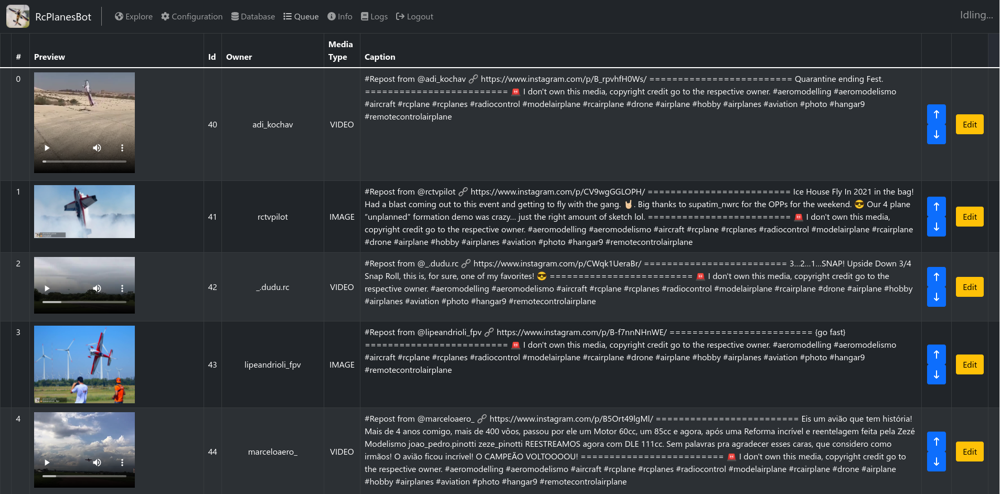

- Logs: application logs
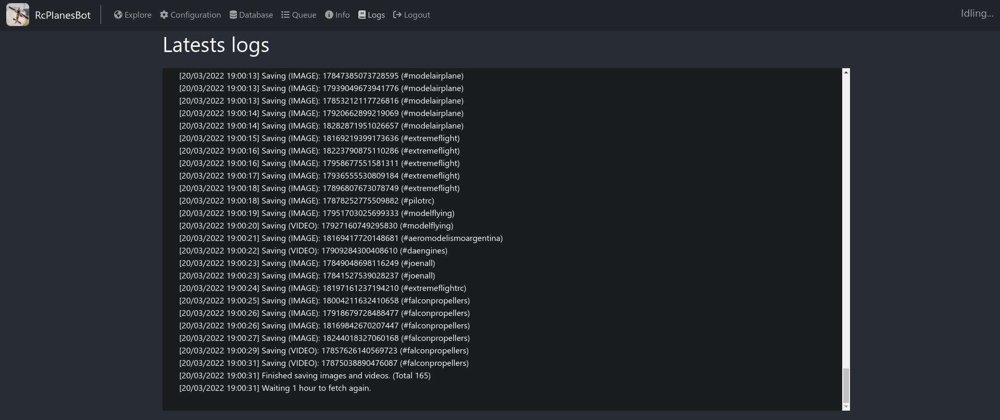

### Installation
#### Regular install
1. Clone the repo.
   ```sh
   $ git clone https://github.com/FranciscoDadone/rcplanes.global.bot-webversion
   ```
2. Install dependencies
   ```sh
   $ yarn install
   $ ( cd packages/client && yarn )
   $ ( cd packages/server && yarn )
   $ ( cd packages/common && yarn )
   ```
3. Running on production
    ```sh
    $ ( cd packages/client && yarn build )
    $ ( cd packages/server && yarn build )
    $ ( cd packages/common && yarn build )
    $ yarn start
    ```
4. Running on development
    ```sh
    $ yarn dev
    ```


### Docker install
1. Build the image
    ```Dockerfile
    $ docker build . -t rcplanes.global.bot
    ```

2. Running the image
    ```Dockerfile
    $ docker run -d -p <PORT>:8080 --restart unless-stopped rcplanes.global.bot
    ```

# Authentication credentials
### Steps:
 - Create a Facebook Application at https://developers.facebook.com/. 
 - Add ```Facebook login``` and ```Instagram Graph API```.
 - Go to https://developers.facebook.com/tools/explorer/ and select this permissions:
      - pages_show_list
      - business_management
      - instagram_basic
      - instagram_manage_comments
      - instagram_manage_insights
      - instagram_content_publish
      - instagram_manage_messages
      - pages_read_engagement
      - pages_read_user_content
- Following the next step... Generate the Access Token.

### Credentials
- Auth Token: Read the Steps above.
- Client ID
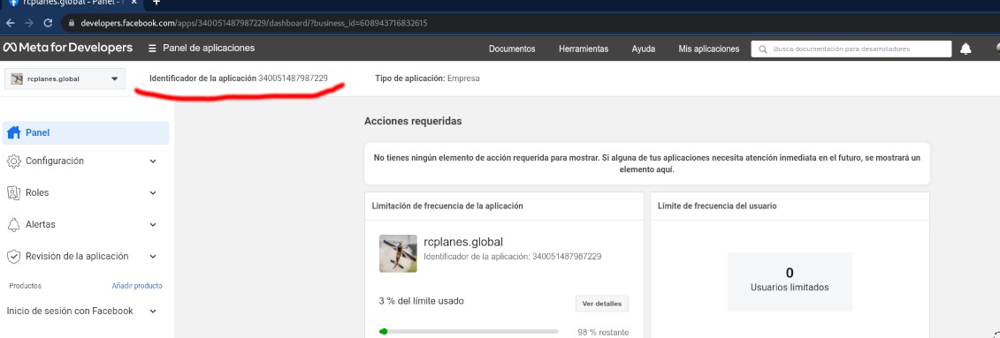
- Client secret (https://developers.facebook.com/apps/340051487987229/settings/basic/)
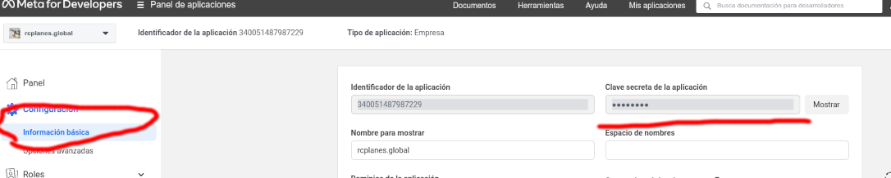
- Instagram account ID ( search for 'fbid' in https://www.instagram.com/rcplanes.global/?__a=1 )

# API Endpoints
  To be documented

<!-- CONTACT -->
# Contact

- Francisco Dadone - [@FranDadone](https://twitter.com/FranDadone) - dadonefran@gmail.com

- Project Link: [https://github.com/FranciscoDadone/rcplanes.global.bot-webversion](https://github.com/FranciscoDadone/rcplanes.global.bot-webversion)


# TO-DO
- Access Token auto-refresh
- Profiles fetching
- Posting schedule
- Manually add post to queue
- 2FA Authentication to the panel
