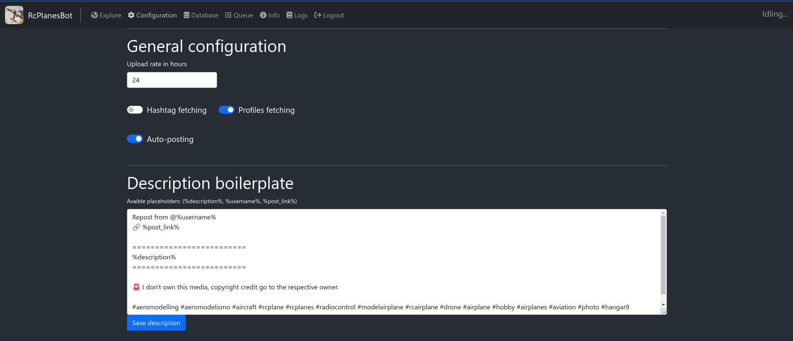

<!-- PROJECT LOGO -->
<br />
<p align="center">
  <a href="https://github.com/FranciscoDadone/rcplanes.global.bot">
    
</a>

  <h3 align="center">rcplanes.global.bot</h3>
  <p align="center">
  Instagram bot to fetch images and videos of RC planes and repost them.
<br />
    <br />
  </p>
</p>

This started as a way to advertise and make more visible RC stuff.

It's a bot that fetches posts from different hashtags using the Instagram API and let you add media to a queue to later be auto-posted (with a given rate). It also adds a watermark with the page mention and original post owner credit in the left bottom of all the images. It has a user-friendly web interface built with ```ReactJS``` that let you know all that is happening in the app.

This project is based on my other project that is the same app but built using Electron for Desktop.

### Built With

* [NodeJS](https://nodejs.org)
* [Express](https://expressjs.com)
* [Sqlite3](https://www.sqlite.org/index.html)
* [ReactBootstrap](https://react-bootstrap.github.io/)
* [ReactJS](https://reactjs.org/)
* [TypeScript](https://www.typescriptlang.org/)
* [Docker](https://www.docker.com/)
* [Instagrapi (modified)](https://github.com/FranciscoDadone/instagrapi-rest)
* [Facebook Public API](https://developers.facebook.com/)

# Known issues
If the server says that it cannot login, use this command to open a stdin and enter the code.
```sh
docker attach rcplanesglobalbot-webversion-instagrapi-1
```

# Images
- Login page: Dashboard login (default creds: admin:admin)


- Explore page: Main page where fetched content will show.


- Media popup: this shows when you click an image in the explore page and let you decide to delete that post or send it to the queue.


- Configuration page



- Database page: page that shows database contents.


- Queue: media queue of selected content.


- Logs: application logs


### Installation
### Docker install (recomended)
1. Edit the ```docker-compose.yml``` fields (target: development or production; and volumes)
2. Build the image
    ```Dockerfile
    $ docker-compose up
    ```

#### Regular install
1. Clone the repo.
   ```sh
   $ git clone https://github.com/FranciscoDadone/rcplanes.global.bot
   ```
2. Install dependencies
   ```sh
   $ yarn install
   $ ( cd packages/client && yarn )
   $ ( cd packages/server && yarn )
   $ ( cd packages/common && yarn )
   ```
3. Running on production
    ```sh
    $ ( cd packages/client && yarn build )
    $ ( cd packages/server && yarn build )
    $ ( cd packages/common && yarn build )
    $ yarn start
    ```
4. Running on development
    ```sh
    $ yarn dev
    ```
5. Running instagrapi-rest server
   ```sh
   docker run -p 8081:8000 instagrapi-rest
   ```

# API Endpoints
  # /auth/
  ### POST ```/auth/login```
  Receives a username and password.
  * data: { username, password }
  * Return: ```SUCCESS``` when authenticated or ```INCORRECT_CREDENTIALS``` when no user found with that credentials. 

  ### POST ```/auth/logout```
  Logs the user out. 
  * Return: ```SUCCESS``` when logged out.

  ### GET ```/auth/user```
  Gets the current logged user. Same as ```/api/user```

  # /api/
  ### GET ```/api/user```
  Returns current authenticated user. Same as ```/auth/user```
  
  ### GET ```/api/status```
  Current app status.
  * Return: ```Idling...``` or ```Saving posts``` or ```Uploading new post!``` or ```NOT_AUTHENTICATED``` or ...

  ### GET ```/api/post_process_image```
  Receives a instagram post id (stored image name) and username and returns a postprocessed image with the watermark.
  * params: { image, username }
    * image: instagram post id (stored image path).
    * username: username to add to the watermark.
  * Return: Base64 image with the watermark added.
  
  ### GET ```/api/post_process_image/by_id```
  Receives a post id stored in the queue and username and returns a postprocessed image with the watermark.
  * params: { image, username }
    * image: instagram post id (stored image path)

  # /api/general/
  ### GET ```/api/general/general_config```
  Returns the general config: 
  * Return: { uploadRate, descriptionBoilerplate, hashtagFetching, autoPosting }

  ### POST ```/api/general/set_general_config```
  Receives general config fields and stores them in the database.
  * data: { uploadRate, descriptionBoilerplate, hashtagFetching, autoPosting }

  ### GET ```/api/general/credentials```
  Returns the stored Instagram/Facebook credentials.
  * Return: { accessToken, clientSecret clientId, igAccountId }

  ### POST ```/api/general/set_credentials```
  Receives Instagram/Facebook credentials and stores them in the database.
  * data: { accessToken, clientSecret, clientId, igAccountId }

  ### GET ```/api/general/util```
  Returns utils table.
  * Return: { lastUploadDate, totalPostedMedias, queuedMedias }

  ### POST ```/api/general/change_dashboard_credentials```
  Receives the old password to compare the proceed with the change and the new username and password.
  * data: { oldPassword, newPassword, newUsername }
  * Return: ```SUCCESS``` if the change succeded or ```PASSWORD_MISSMACH``` if the old password doesn't match with the one on the database.

  ### GET ```/api/general/logs```
  Server logs at runtime.
  * Return: logs as string

  ### POST ```/api/general/delete_from_storage```
  Receives a file name and deletes it from storage.
  * data: { fileName }
  * Return: ```SUCCESS``` or ```FAIL```

  ### POST ```/api/general/trim_video```
  Receives a storage path of a video, seconds from the start and the end to cut that video.
  * data: { path, start, end }
  * Return: ```SUCCESS``` or ```FAIL```

  # /api/hashtags/
  ### GET ```/api/hashtags/hashtags```
  Returns an array of all hashtags to fetch.
  * Return: [{ hashtag }]

  ### POST ```/api/hashtags/add```
  Receives a new hashtag and adds it to the database of hashtags to fetch.
  * data: { hashtag }

  ### DELETE ```/api/hashtags/delete```
  Receives a hashtag and deletes it from the database of hashtags to fetch.
  * params: { hashtag }

  # /api/posts/
  ### GET ```/api/posts/non_deleted_fetched_posts```
  Returns an array of all the posts that have not been deleted, queued or posted.
  * Return: [{ postId, mediaType, storagePath, caption, permalink, hashtag, status, date, username, childrenOf }]

  ### GET ```/api/posts/all_fetched_posts```
  Returns an array of all fetched posts.
  * Return: [{ postId, mediaType, storagePath, caption, permalink, hashtag, status, date, username, childrenOf }]

  ### DELETE ```/api/posts/delete```
  Receives a post id and deletes that post from the fetched posts.
  * params: { postId }

  ### POST ```/api/posts/queue```
  Receives a post and adds it to the queue.
  * data: { id, mediaPath, usernameInImg, mediaType, caption, owner }
    * id: fetched post id
    * mediaPath: where the media is stored in the filesystem.
    * mediaType: IMAGE or VIDEO
    * caption: post caption
    * owner: post owner aka username

  # /api/queue/
  ### GET ```/api/queue/queue```
  Returns an array of the current posts in queue.
  * Return: [{ id, media, mediaType, caption, owner }]

  ### POST ```/api/queue/swap```
  Receives the id's of two posts and swaps them in the queue.
  * data: { id1, id2 }

  ### DELETE ```/api/queue/delete```
  Receives a post id and deletes that post from the queue.
  * params: { id }
  
  ### PATCH ```/api/queue/update_post```
  Receives a post id and the caption and updates it on the database.
  * data: { id, caption }

  ### POST ```/api/queue/upload```
  Receives a file and stores it on server storage.
  * data: { file }
  * Return: uploaded file details.
  
  ### POST ```/api/queue/top_to_bottom```
  Moves a post from the top to the bottom of the queue.

  ### POST ```/api/queue/bottom_to_top```
  Moves a post from the buttom to the top of the queue.

  # /api/profiles/
  ### POST ```/api/profiles/add```
  Receives a new username and adds it to the database of profiles to fetch.
  * data: { username }

  ### POST ```/api/profiles/delete```
  Receives a username and deletes it from the database of profiles to fetch.
  * params: { username }

  ### POST ```/api/profiles/profiles```
  Returns all the profiles stored in the database to fetch.

<!-- CONTACT -->
# Contact

- Francisco Dadone - [@franciscodadone](https://www.instagram.com/franciscodadone/) - dadonefran@gmail.com

- Project Link: [https://github.com/FranciscoDadone/rcplanes.global.bot](https://github.com/FranciscoDadone/rcplanes.global.bot)


# TO-DO
- Access Token auto-refresh (DONE)
- Profiles fetching (DONE)
- Posting schedule
- Manually add post to queue (DONE)
- 2FA Authentication to the panel
- Modify database page to show all tables
- Add more info to the Info page
- Add Insights
- Fix infinite loading times when moving media in queue
